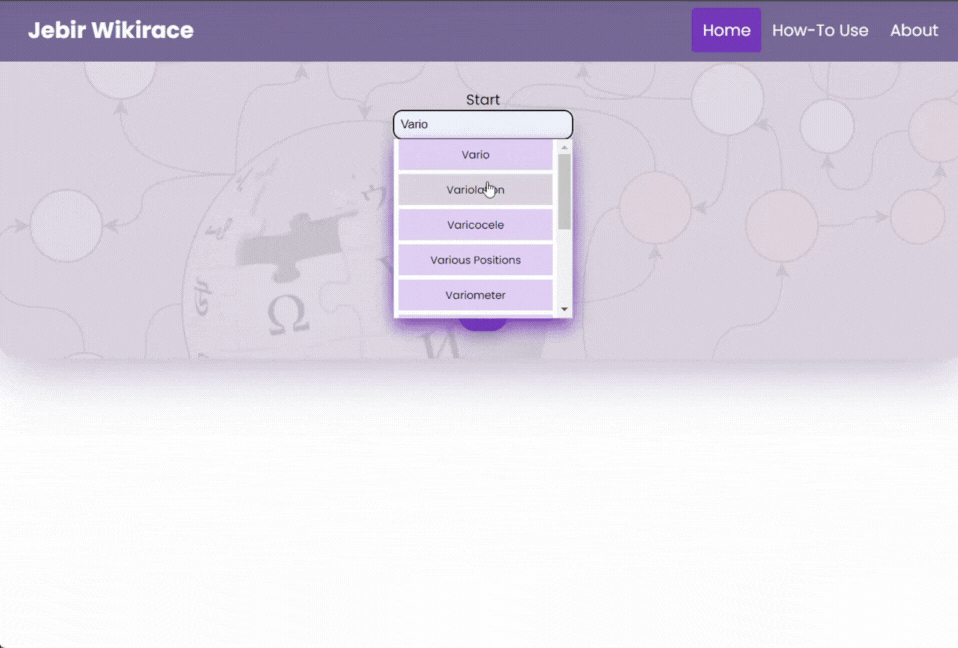

# Tugas Besar II Strategi Algoritma (IF2211)
## Kelompok Jebir:
* Muhammad Naufal Aulia 			(13522074)
* Keanu Amadius Gonza Wrahatno		(13522082)
* Naufal Adnan					(13522116)


## Table of Contents
* [Website Jebir Wikirace](#jebir)
* [Dokumentasi](#dokumentasi)
* [Dependencies](#dependencies)
* [How to Use](#how-to-use)


## Jebir Wikirace: Implementasi Algoritma BFS dan IDS  <a href="jebir"></a>
> Jebir WikiRace adalah sebuah website solver atas permainan WikiRace yang memungkinkan pengguna untuk melakukan pencarian artikel Wikipedia dari artikel awal ke artikel target dengan rute penjelajahan artikel terdekat melalui hipertaut artikel yang ada di dalamnya.

Dalam rangka menemukan rute penjelajahan terpendek, digunakan pendekatan algoritma BFS dan IDS. 
BFS (Breadth-First Search) adalah metode penjelajahan graf yang dimulai dari simpul awal dan berlanjut ke tetangga-tetangga dari simpul tersebut sebelum menjelajahi simpul yang lebih jauh. Dalam BFS, struktur data queue digunakan untuk menyimpan simpul-simpul yang akan dikunjungi. Algoritma ini memastikan bahwa simpul-simpul dikunjungi dalam urutan lebar, memungkinkan penemuan jalur terpendek antara dua simpul pada graf tidak berarah dan tanpa bobot. Langkah pada BFS (simpul adalah artikel wikipedia):
* Kunjungi simpul awal.
* Kunjungi seluruh tetangga dari simpul awal terlebih dahulu.
* Kunjungi simpul-simpul yang belum dikunjungi dan bertetangga dengan simpul-simpul yang telah dikunjungi sebelumnya.
* Ulangi langkah-langkah tersebut hingga seluruh simpul pada graf telah dikunjungi.


Sedangkan IDS (Iterative Deepening Search) menggabungkan DFS dan DLS secara iteratif untuk menggabungkan keuntungan efisiensi memori DFS dan jaminan solusi dalam kedalaman tertentu dari DLS. Namun, IDS tidak selalu efisien dalam graf dengan cabang yang panjang. DLS mirip dengan DFS tetapi dengan batasan kedalaman l. Prosesnya: 
* kunjungi simpul v, 
* kunjungi tetangga simpul v, 
* ulangi DFS dari tetangga,  
* backtrack jika sudah mencapai kedalaman maksimal atau semua tetangga telah dikunjungi. 
* Proses berakhir jika tidak ada simpul yang bisa dikunjungi lagi.

Pada algoritma IDS, penjelajahan dilakukan dengan melakukan serangkaian DFS seperti pada skema di atas, dengan peningkatan nilai kedalaman cut-off, hingga solusi ditemukan


## Dokumentasi <a href="dokumentasi"></a>


## Dependencies <a href="dependencies"></a>
- Go 
- Node.js
- Docker desktop

## How to Use <a href="how-to-use"></a>
0. Siapkan requirement jika belum di-install:
    - Node.js (https://nodejs.org/en) 
    - Docker desktop (https://www.docker.com/products/docker-desktop/) 
    - Go Lang (https://go.dev/doc/install)
    - Yarn

1. Clone repository ini pada link berikut:
    ```
    https://github.com/nanthedom/Tubes2_Jebir.git
    ```
2. Masuk ke folder hasil clone dan buka terminal
3. Masuk ke folder src 
    ```
    cd src
    ```
4. Program ini dapat dijalankan menggunakan docker maupun secara manual. Jika dengan Docker, caranya:
    * Buka dahulu Docker desktop pada device Anda
    * Pada direktori ini (Tubes2_Jebir/src), ketik 
        ``` 
        docker-compose up 
        ```
    * Tunggu hingga build berhasil, program akan langsung berjalan dan dapat diakses di browser pada: 
        ```
        http://localhost:3000/
        ```
    Jika dijalankan secara manual, maka langkahnya adalah:
    * Masuk ke direktori backend (Tubes2_Jebir/src/backend)
      ```
      cd backend
      ```
      pastikan direktori sekarang berada pada `Tubes2_Jebir/src/backend`
    * Jalankan backend dengan mengetik:
      ```
      go run main.go
      ```
    * Buka terminal baru, masuk ke direktori frontend dengan:
      ```
      cd src/frontend
      ```
    * Install semua depedencies dengan:
      ```
      npm install
      ```
    * Jalankan frontend dengan:
      ```
      npm start
      ```
    * Program sudah berjalan dan dapat diakses di browser melalui:
        ```
        http://localhost:3000/
        ```
5. Setelah berhasil dijalankan, pengguna dapat memasukan artikel yang hendak dicari rutenya, memilih algoritma yang ingin digunakan, dan melihat hasilnya.
6. Program akan menampilkan rute penjelajahan terpendek antara kedua artikel masukan dalam bentuk visualisasi graf, waktu eksekusinya, jumlah artikel yang diklik untuk mencapai artikel tujuan, dan jumlah artikel yang diperiksanya. Jika rute lebih dari satu maka akan ditampilkan juga jumlah rutenya.